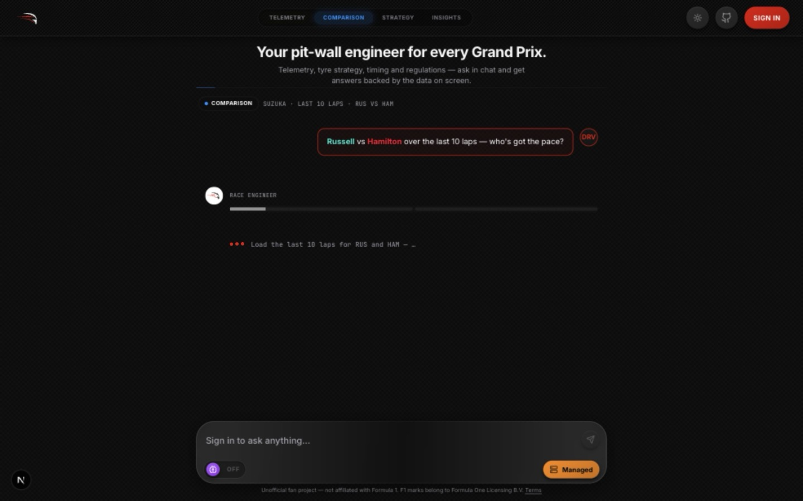
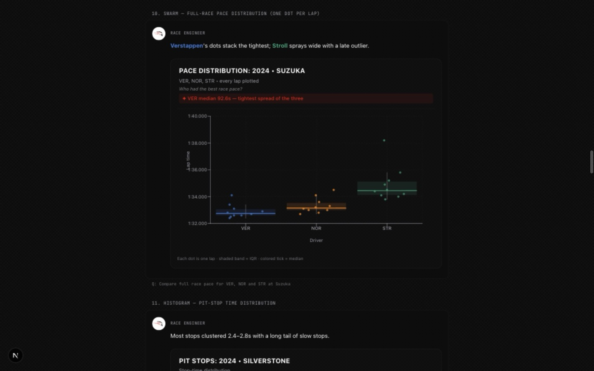
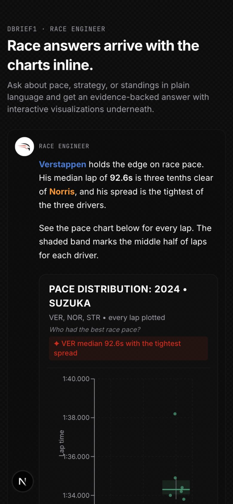

# Dbrief1

Dbrief1 is a race-engineering chat for Formula 1. Ask about lap times, telemetry, qualifying, race results, strategy, weather, and regulations in plain language, and get evidence-backed answers with interactive charts rendered inline underneath.



## How it answers

Every answer is built from real data, never from model memory. The pipeline plans tool calls, runs them against live F1 data sources, and synthesizes the response from the collected evidence with inline citations. Chartable answers arrive with interactive visualizations rendered directly in the chat.



The same experience holds on phones, where the layout collapses to a single column without losing charts or actions.



## Repository layout

- `main/` — the Next.js web app (chat UI, API routes, planners, executors, and the visualization layer).
- `api/` — the FastAPI microservice that wraps FastF1 telemetry, timing, and session data behind structured HTTP endpoints. See `api/README.md` for its setup.
- `assets/` — screenshots used by this document.

## Quickstart

Prerequisites are Node 20+, Python 3.11+, and (for cloud sync) a Cloudflare account with a D1 database and an R2 bucket.

```bash
# 1. Backend data service
cd api
python -m venv venv && source venv/bin/activate
pip install -r requirements.txt
cp ../main/env.example ../main/.env.local  # then fill in keys
uvicorn main:app --port 8000

# 2. Web app (new terminal, from the repo root)
cd main
npm install
npm run dev
```

Open http://localhost:3000 and sign in with Google to start chatting. The gallery of every chart type lives at http://localhost:3000/viz and needs no sign-in.

Key environment values are documented in `main/env.example`. Secrets belong in `.env.local`, which is gitignored and must never be committed.

## Testing

```bash
cd main
npm test            # full unit suite (vitest)
npm run lint        # eslint
npx tsc --noEmit    # typecheck
```

Pull requests must keep the suite green. The one excluded file, `planner.test.ts`, calls a live model and only runs with API keys configured.

## Contributing

Contributions are welcome — please read [CONTRIBUTING.md](CONTRIBUTING.md) first. In short: open focused pull requests against `main`, keep tests passing, and follow the house style (flowing sentences, no emojis, no em dashes).

## Security

See [SECURITY.md](.github/SECURITY.md) for how to report vulnerabilities. Do not open public issues for security problems.

## Disclaimer

Dbrief1 is an independent, unofficial fan project. It is not affiliated with, endorsed by, or sponsored by Formula 1, Formula One Licensing B.V., Formula One Management, the FIA, or any team, driver, circuit, or sponsor.
